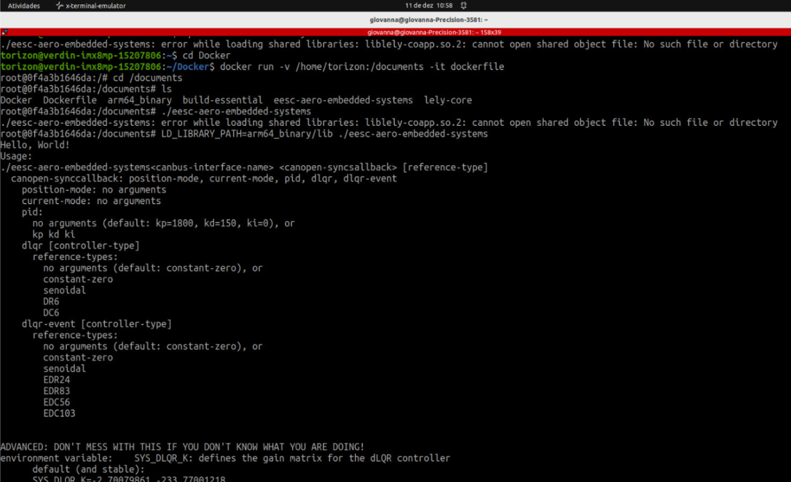
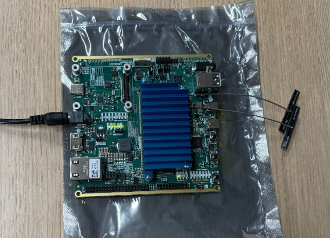
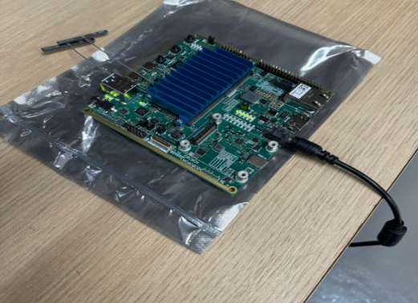

# README - Projeto Sistemas Embarcados

## Link do video:
https://drive.google.com/file/d/1g2oXlC1Nnx3MZ7_3TSufZGXyRm3sLBVT/view?usp=sharing

## Alunos:

| Nome                             | Matrícula   | Responsabilidade                 |
|----------------------------------|-------------|----------------------------------|
| Giovanna Herculano Tormena       | 12674335    | Cross-compiling para arm64       |
| Bruno Ciotta Fernandes           | 12549874    | Cross-compiling para arm32       |
| Juliana de Oliveira Martins      | 12693945    | Embarcar na Toradex              |
| Carlos Demoliner Kubota          | 12549658    | Embarcar na Toradex              |

## Tarefa:

O trabalho da disciplina de Sistemas Embarcados possui dois principais objetivos. O primeiro consiste em buildar o projeto disponibilizado aos alunos, construído para arquitetura arm32, à partir do uso de ferramentas como Docker e uso de cross compiling. Após atingir êxito nessa etapa, partimos para o segundo objetivo: propor uma mudança ao projeto e implementá-la.

Para a primeira parte do projeto, foram feitas mudanças no Dockerfile (inclusão de bibliotecas e ajustes de configure, arquivo chamado `Dockerfile_arm32`), além de mudanças no `CMakeLists.txt` para incluir diretórios e dependências necessárias. Além disso, fizemos git clone da biblioteca lely-core, e então seguimos um tutorial disponibilizado no próprio GitHub da biblioteca para compilá-la para arm32. Com a biblioteca compilada e o Dockerfile corrigido, buildamos a imagem e abrimos seu container com permissão para acessar a pasta do projeto por dentro do container, a fim de termos acesso a todos os arquivos e à biblioteca lely-core. Dentro do container, criamos uma pasta chamada `build_arm32`, onde damos os comandos necessários para finalmente buildar o projeto (`cmake -DARM_TARGET=1 ..` para fazer a cross-compilação e `make`). Assim, foi criado o arquivo executável para arm32 `eesc-aero-embedded-systems`, dentro da pasta `build_arm32`.

Para a segunda parte do projeto, o professor Glauco sugeriu o desafio de rodar a aplicação em uma placa da Toradex, uma Verdin iMX8MP ao invés da Beaglebone. Para isso, precisamos alterar toda a arquitetura do projeto para arm64, visto que essa é a arquitetura da placa. Para isso, criei uma cópia do Dockerfile e comecei a pensar em quais as alterações necessárias. Primeiramente, a arquitetura setada passou de "armhf" para "arm64". Todas as bibliotecas matemáticas foram alteradas também para serem compatíveis com o arm64. Por fim, o host do comando `RUN configure` passou de `arm-linux-gnueabihf` para `aarch64-linux-gnu`. O novo Dockerfile chama-se `Dockerfile_arm64`.

Além disso, para tornar a cross-compilação viável, incluímos um caso no `CMakeLists` que possibilita a passagem de uma nova tag para indicação de arm64. Inicialmente, se a tag `ARM_TARGET` for setada como 1 na compilação, o cross-compiling é feito e o projeto é buildado para arm32 e para verificação é impresso na tela "ARM INDEED!". Caso contrário, a compilação é feita para x86 (vale ressaltar que, para quesitos de aprendizagem, também buildamos todo o projeto para x86, e os arquivos gerados e o executável foram salvos na pasta `build_x86`). Assim, pode-se verificar que foi criada uma tag adicional, chamada `ARM64_TARGET`, que ao ser setada como 1 ao buildar, o cross-compiling é feito para arm64 ao invés de arm32.

Após todas essas alterações, repetimos o processo: recompilei a lely-core para arm64, buildei uma nova imagem com o Dockerfile novo e abri seu container com a mesma permissão descrita anteriormente. Criei a pasta `build_arm64`, e lá utilizamos os comandos de build, agora passando a nova tag (`cmake -DARM64_TARGET=1 ..` para fazer a cross-compilação e `make`). Para verificação, é impresso na tela "ARM64!". Assim, o executável em arm64 foi criado com sucesso, também chamado `eesc-aero-embedded-systems`, mas agora dentro da pasta `build_arm64`.

Agora, o desafio consistiu em aprender a utilizar a placa da Toradex para inserir esse executável na placa e conseguir rodá-lo. Pegamos o heat sink emprestado com o Henrique. Primeiramente, precisamos conectar o meu computador e a placa à mesma rede de Wi-Fi. Assim, acessamos a placa por SSH. Para isso, foi necessário saber o IP e o número de identificação da iMX, que vem escrito nela em uma etiqueta. Com acesso à placa por meio do meu computador, fizemos cópias dos arquivos necessários para dentro da placa. Quais os arquivos necessários? O arquivo executável, o Dockerfile e a biblioteca lely-core já compilada para arm64. 



Aí começamos a ter muitas dificuldades. Primeiramente, nós achávamos que o Dockerfile que deveríamos mandar à placa seria o mesmo que utilizamos para criar o container responsável por buildar o projeto. No entanto, como o objetivo ao utilizar a placa é rodar um projeto já buildado, o Dockerfile necessário na placa é extremamente mais simples, só seta o container inicial como o `debian:11` e instala algumas bibliotecas matemáticas necessárias:

```dockerfile
FROM debian:11 AS builder

LABEL authors="Giovanna Tormena, Bruno Ciota, Juliana Martins, Carlos Kubota"

RUN apt-get -y update \
    && apt-get -y install \
    libopenblas0 \
    liblapack3 \
    libarpack2 \
    libsuperlu5 \
    libarmadillo10
```

Esse Dockerfile está salvo no projeto como `Dockerfile_toradex`. Depois disso, o desafio foi entender quais os arquivos da lely-core que deveriam ser inseridos na placa. Após um bom tempo, com ajuda do Henrique, percebemos que estávamos inserindo a biblioteca "crua", ou seja, não eram os arquivos binários já compilados para arm64. Esses arquivos são gerados quando o container é aberto, e quando ele é fechado os arquivos não são salvos. Assim, reabrimos o container com um comando diferente, que permitisse salvar no meu computador arquivos gerados dentro do container. Assim, conseguimos salvar os arquivos binários da lely-core para arm64 na pasta `arm64_binary`. É essa a pasta que devemos mandar à placa. Assim, com `arm64_binary`, o Dockerfile descrito acima e o executável para arm64 criado anteriormente inseridos na placa, abrimos o container desse Dockerfile, setamos as bibliotecas extras necessárias como aquelas inclusas na pasta `arm64_binary` e rodamos o executável: `./eesc-aero-embedded-systems`. Assim, conseguimos atingir o objetivo do desafio proposto pelo professor e conseguimos rodar o projeto na placa Toradex com sucesso! Quando conseguimos rodar, tivemos a verificação do funcionamento pela impressão de "Hello World!" na tela:



Assim, finalizamos o projeto! Veja abaixo algumas fotos tiradas no Hangar da Aeronáutica, onde fomos para utilizar a placa:



Gostaríamos de agradecer o Henrique, por ter disponibilizado muitas horas para nos ajudar e nos explicar diversos conceitos técnicos envolvidos no projeto. Ele foi essencial, um professor excelente. Agradecemos também o Leonardo, que dedicou bastante tempo a nos ajudar com a placa, sendo muito atencioso. Por fim, nossos agradecimentos ao professor Glauco, por nos ter proposto um projeto desafiador e cheio de tecnologias atuais e que realmente são utilizadas na indústria.
